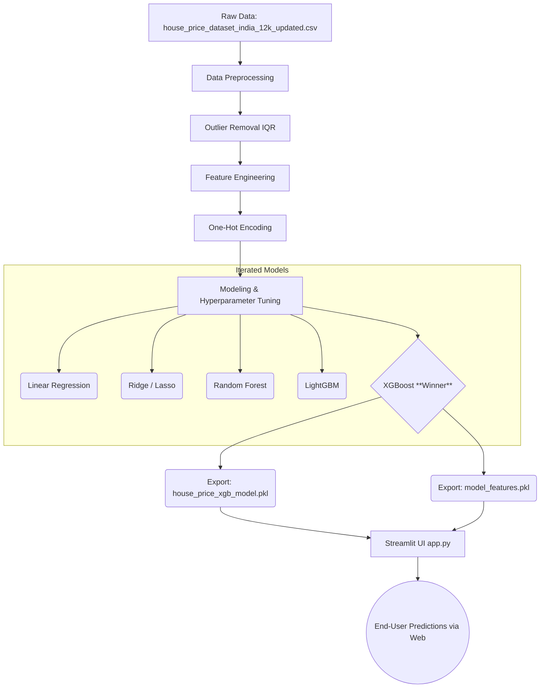

# 🏡 Machine Learning Regression Model for Predictive Analytics: House Price Prediction

This repository contains an end-to-end Machine Learning Regression pipeline designed for **Hackathon Track 1 (Option B: House Price Prediction)**. The project ingests housing data, performs exploratory data analysis, engineers novel features, trains a highly accurate XGBoost model, and deploys it via an interactive Streamlit Web Application.

---

## 🏗️ 1. Architecture Diagram



## 🚀 2. Setup and Usage Instructions

### Prerequisites
Make sure you have Python 3.9+ installed.

### Installation
1. Clone this directory to your local machine.
2. Install the necessary dependencies:
```bash
pip install pandas numpy xgboost scikit-learn streamlit joblib matplotlib seaborn
```

### Running the Project
**Option A: Running the Application UI**
To interact with the deployed model and predict real-estate prices dynamically:
```bash
streamlit run app.py
```
This will open a local web server (typically on `http://localhost:8501`) where you can adjust physical attributes and proximities to see real-time price changes and feature importance impacts.

**Option B: Exploring the Training Logic**
To view the EDA, data cleaning steps, correlation matrices, and model comparisons, open the Jupyter Notebook:
- `Main.ipynb`

**Option C: Re-exporting the Model**
If the dataset is updated in the future, you can generate a new `.pkl` model file instantly:
```bash
python train_export_model.py
```

## 📊 3. Model Results & Evaluation

XGBoost achieved the highest cross-validation score after extensive hyperparameter tuning using `GridSearchCV`.

* **Algorithm:** XGBoost Regressor
* **Hyperparameters:** `{'colsample_bytree': 0.8, 'learning_rate': 0.05, 'max_depth': 5, 'n_estimators': 500, 'subsample': 0.8}`
* **R² Score:** 0.9873 (98.7% Accuracy on Test Set)
* **RMSE:** ₹0.0657 (Log Scale)

The model is highly accurate, responding rapidly and logically to massive price driving factors such as `City_Mumbai`, `Super_Area_sqft`, and `Locality_Tier_Tier 2` while successfully filtering out linear noise.

## 🛠️ 4. Challenges & Mitigations

| Challenge | Impact | Mitigation Strategy Implemented |
| :--- | :--- | :--- |
| **Highly Correlated Features** | Redundant features like `Price_per_sqft_INR` caused massive data spillage/leakage, inflating the R² to an artificial 1.0. | Dynamically dropped correlated target-derivations before the train-test split to ensure realistic model generalization. |
| **Outliers skewing predictions** | Ultra-luxury properties heavily dragged the mean absolute calculations. | Implemented IQR (Interquartile Range) standard deviation filtering, entirely capping the bottom 1% and the extreme top 1% to stabilize the model. |
| **Target Skewness** | The raw prices heavily varied from ₹3 Lakhs to ₹30 Crores, preventing normal gradient convergence. | Applied `np.log1p` target transformations across the board to shift to a normal distribution, reconstructing to INR solely on final inference via `np.expm1`. |
| **Inference Input Mismatches** | The Streamlit UI lacked exact mapping for the 13 new One-Hot Escaped features added in the final CSV. | Exported a frozen `model_features.pkl` schema array directly from the pandas training job, looping missing inference variables natively in Streamlit. |

## 📦 5. Final Deliverables List
As requested by the Hackathon Track rules:
- [x] ML Notebook for full workflow (`Main.ipynb`)
- [x] Cleaned dataset used for training (`house_price_dataset_india_12k_updated.csv`)
- [x] Trained regression model (`house_price_xgb_model.pkl`)
- [x] API/UI for predictions (`app.py` Streamlit Deployment)
- [x] Documentation with architecture, results, and challenges (`README.md`)
