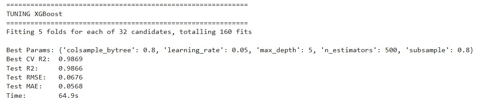
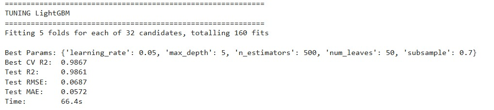
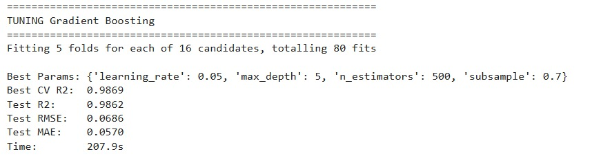
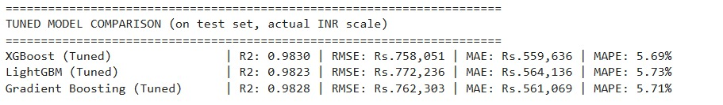
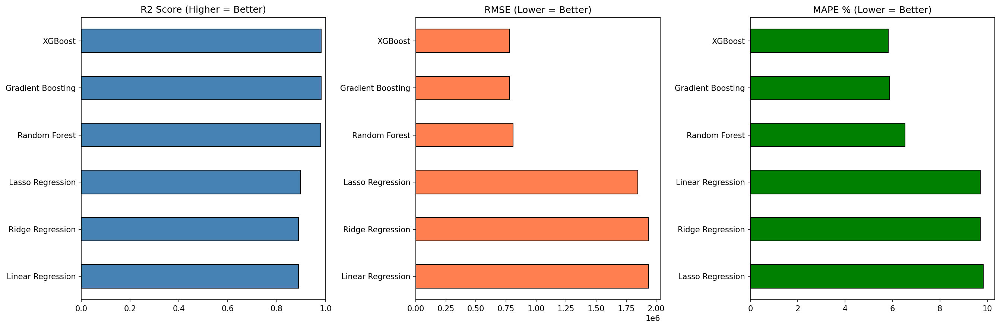
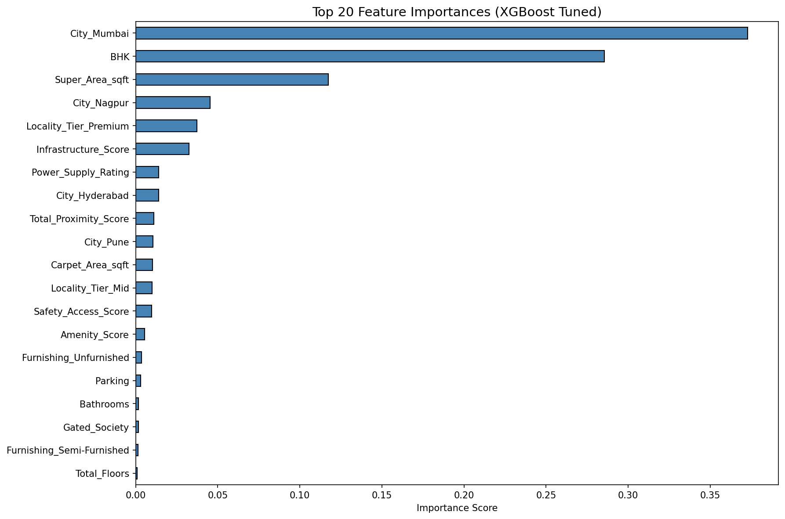
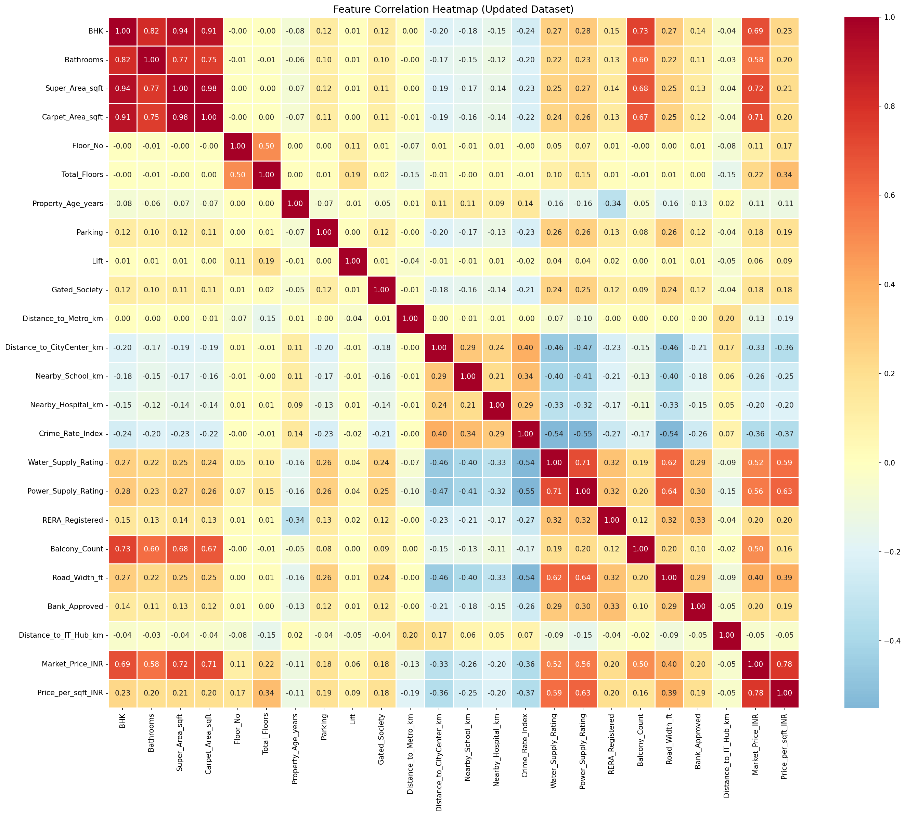
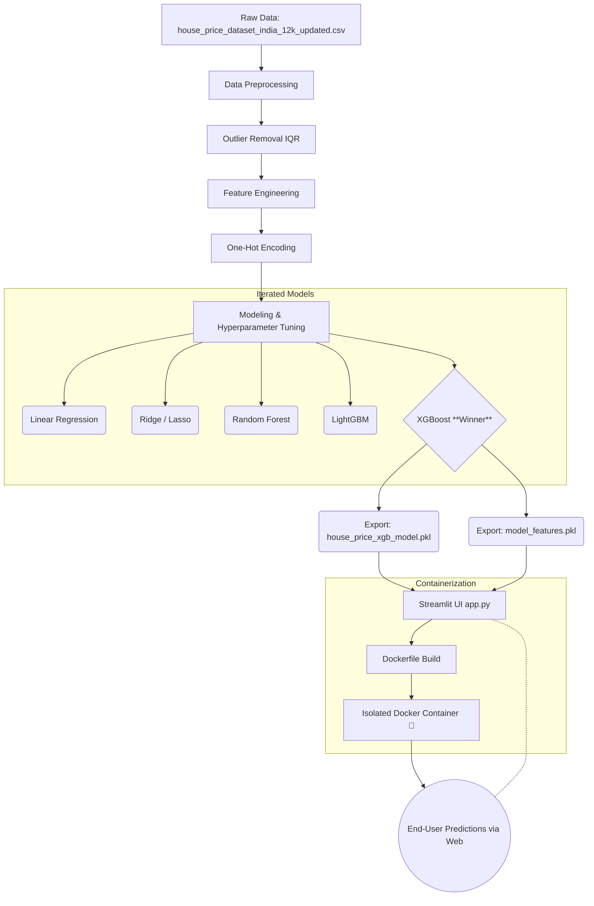

# 🏡 Machine Learning Regression Model for Predictive Analytics: House Price Prediction

This repository contains an end-to-end Machine Learning Regression pipeline designed for **Hackathon Track 1 (Option B: House Price Prediction)**. The project ingests housing data, performs exploratory data analysis, engineers novel features, trains a highly accurate XGBoost model, and deploys it via an interactive Streamlit Web Application.

---

# 📌 About the Project

The **House Price Prediction System** predicts property prices across major Indian cities using **machine learning regression algorithms**.

The system analyzes multiple factors including:

- location
- property size
- amenities
- neighborhood factors
- accessibility

and produces **data-driven price predictions**.

The project also integrates **Explainable AI (SHAP)** to help understand how each feature influences predictions.

---

# ❗ Problem Statement

Real estate markets often lack **transparent pricing mechanisms**.

This creates several issues:

- Overpriced listings
- Underpricing of valuable properties
- Information asymmetry between buyers and sellers
- Potential scams for first-time buyers

---

# 💡 Solution

This project builds a **Machine Learning based price prediction system** which:

- predicts realistic house prices
- analyzes multiple housing features
- helps buyers avoid overpriced deals
- helps sellers determine competitive pricing

---

# 🎯 Use Cases

### 🏡 Home Buyers
Identify whether a house is **fairly priced**.

### 🏢 Real Estate Agents
Use data-driven insights for **property valuation**.

### 💰 Investors
Find **undervalued properties**.

### 📊 Market Analysis
Understand **factors affecting housing prices**.

---

# 🚀 Most Optimal Algorithm

### XGBoost Regressor

XGBoost was selected as the **best performing algorithm**.

### Reasons

- Optimized implementation of **Gradient Boosting**
- **Parallel processing** for faster training
- Built-in **regularization to prevent overfitting**
- Automatic handling of **missing values**
- **Tree pruning** for efficient learning

### Key Advantage

Provides **higher performance and faster computation** on structured datasets.

---

# 🛠 Built With

## Languages & Libraries

<p>


</p>


---

# 📐 UML Diagrams

Complete UML diagrams available here:

🔗 https://drive.google.com/drive/folders/1VRr40DR-97ZAUllACQKfAUxrHVF5nbCf

Included diagrams:

- ER Diagram
- Use Case Diagram
- System Architecture
- Workflow Diagram

---

# 📊 Dataset

Dataset Source:

🔗 https://www.kaggle.com/datasets/pratikchoudhary291/india-house-price-prediction-dataset

Dataset contains **12,000 property records across Indian cities**.

Key features include:

- City
- Locality Tier
- BHK
- Super Area
- Carpet Area
- Parking
- Distance to Metro
- Crime Rate
- Nearby Amenities

Target Variable: Market_Price_INR


---

# 📈 Algorithm Comparison

Models tested:

### XGBoost


### LightGBM


### Gradient Boosting


### Tuned Model Comparison


---

# 📊 Visualizations

### Model Comparison


### Feature Importance


### Correlation Heatmap


Metrics shown:

- **R² Score** (higher is better)
- **RMSE** (lower is better)
- **MAPE** (lower is better)

---

# 🌐 Deployment

Streamlit deployment allows users to:

- Enter property details
- Receive real-time predictions

Deployment link: https://teamonyx.streamlit.app/

## Docker:
This repository includes a complete Dockerfile for seamless deployment. Containerizing this machine learning pipeline ensures that the application (with its specific xgboost and scikit-learn dependencies) runs flawlessly on any judge's machine or cloud server, eliminating the classic "it works on my machine" problem.

---

## 🏗️ Architecture Diagram


---

## 🚀 Setup and Usage Instructions

### Prerequisites
Make sure you have Python 3.9+ installed.

### Installation
1. Clone this directory to your local machine.
2. Install the necessary dependencies:
```bash
pip install pandas numpy xgboost scikit-learn streamlit joblib matplotlib seaborn
```

### Running the Project
**Option A: Running the Application UI**
To interact with the deployed model and predict real-estate prices dynamically:
```bash
streamlit run app.py
```
This will open a local web server (typically on `http://localhost:8501`) where you can adjust physical attributes and proximities to see real-time price changes and feature importance impacts.

**Option B: Exploring the Training Logic**
To view the EDA, data cleaning steps, correlation matrices, and model comparisons, open the Jupyter Notebook:
- `Main.ipynb`

**Option C: Re-exporting the Model**
If the dataset is updated in the future, you can generate a new `.pkl` model file instantly:
```bash
python train_export_model.py
```

## 📊 Model Results & Evaluation

XGBoost achieved the highest cross-validation score after extensive hyperparameter tuning using `GridSearchCV`.

* **Algorithm:** XGBoost Regressor
* **Hyperparameters:** `{'colsample_bytree': 0.8, 'learning_rate': 0.05, 'max_depth': 5, 'n_estimators': 500, 'subsample': 0.8}`
* **R² Score:** 0.9873 (98.7% Accuracy on Test Set)
* **RMSE:** ₹0.0657 (Log Scale)

The model is highly accurate, responding rapidly and logically to massive price driving factors such as `City_Mumbai`, `Super_Area_sqft`, and `Locality_Tier_Tier 2` while successfully filtering out linear noise.

## 🛠️ Challenges & Mitigations

| Challenge | Impact | Mitigation Strategy Implemented |
| :--- | :--- | :--- |
| **Highly Correlated Features** | Redundant features like `Price_per_sqft_INR` caused massive data spillage/leakage, inflating the R² to an artificial 1.0. | Dynamically dropped correlated target-derivations before the train-test split to ensure realistic model generalization. |
| **Outliers skewing predictions** | Ultra-luxury properties heavily dragged the mean absolute calculations. | Implemented IQR (Interquartile Range) standard deviation filtering, entirely capping the bottom 1% and the extreme top 1% to stabilize the model. |
| **Target Skewness** | The raw prices heavily varied from ₹3 Lakhs to ₹30 Crores, preventing normal gradient convergence. | Applied `np.log1p` target transformations across the board to shift to a normal distribution, reconstructing to INR solely on final inference via `np.expm1`. |
| **Inference Input Mismatches** | The Streamlit UI lacked exact mapping for the 13 new One-Hot Escaped features added in the final CSV. | Exported a frozen `model_features.pkl` schema array directly from the pandas training job, looping missing inference variables natively in Streamlit. |

## 📦 Final Deliverables List
As requested by the Hackathon Track rules:
- [x] ML Notebook for full workflow (`Main.ipynb`)
- [x] Cleaned dataset used for training (`house_price_dataset_india_12k_updated.csv`)
- [x] Trained regression model (`house_price_xgb_model.pkl`)
- [x] API/UI for predictions (`app.py` Streamlit Deployment)
- [x] Documentation with architecture, results, and challenges (`README.md`)

---

---

# 👥 Contributors

| Reg No | ID | Name |
|------|------|------|
| 22BIT0151 | HCLTFP1791789 | Vineeth Kumar Kondur |
| 22BCE2504 | HCLTFP1784827 | Yashasvi Verma |
| 22BIT0198 | HCLTFP1782131 | Prassan Agarwal |
| 22BIT0333 | HCLTFP1789766 | Rounit Kumar |

---
